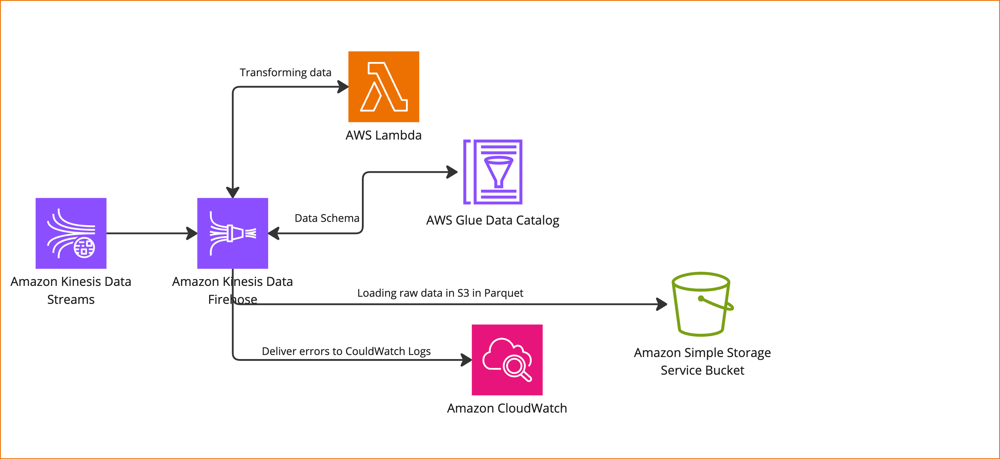

# Architecture diagram

## Architecture
There are multiple ways to design a system to process this data. 

I choose Amazon Data Firehose because it's the easiest way to capture, transform and deliver data stream into Amazon S3.
This service deliver realtime data and reduce stream pipeline maintenance. This service automatically scales based on
the amount of data available, and delivers it within seconds. I didn't consider cost here because I don't know about the
whole architecture, For example maybe it's cheaper if we create a spark application and stream this data and schedule it
in the existing airflow and submit it on Databricks. (I could proceed with some assumptions that we will make this task
complex)

### Cost
Assumption:
* Size of each record: 500 B
* 1 million record per hour

#### Monthly cost:
* Data ingestion: 107.91 USD
* Data format conversion: 66.14 USD
* Dynamic Partitioning: 7.50 USD

Monthly total cost: 181.55 USD

## Design questions
### How would you handle duplicate events?

I assumed this is the raw layer and when we're going to create the staging layer we can handle it there by using event_uuid column

### How would you partition the data to ensure good querying performance and scalability?

Throughput calculation:

500B * 1000000 = 500MB per hour 

500MB * 24 = 12GB per day

12GB * 30 = 360GB per month

12GB / 100 (number of event) = 120MB per event per day

From a simple calculation we can understand that the daily partitioning is enough but as we have different type of event
and users may need to query a specific event type we can also partition the data via event_type

Conclusion:
I would partition the data with event_type and yyyy-MM-dd.

### What format would you use to store the data?
I used Parquet format because of following reasons:
* It compresses the data (reduce cost)
* Increased data throughput and performance using techniques like data skipping, whereby queries that fetch specific column values need not read the entire row of data.
* Schema evolution

### How would you test the different components of your proposed architecture?
I will use unittest and pytest to test my python code, and adding this check to Git CI/CD to check it in merge requests.
One important thing the aws that we can test the policies. It can be done with [Policy simulator](https://policysim.aws.amazon.com/)
### How would you ensure the architecture deployed can be replicable across environments?
As we are using Terraform and created a module for our architecture it could be replicate and deployed on other environments as well.

### Would your proposed solution still be the same if the amount of events is 1000 times smaller or bigger?
Amazon Data Firehose has the feature that automatically scales so we still can use it but if the data get bigger and
cost goes high, it may make sense to switch to spark batch streaming and get the data using spark.
### Would your proposed solution still be the same if adding fields / transforming the data is no longer needed?
I would still use this approach without transform option (Still don't consider cost here)

